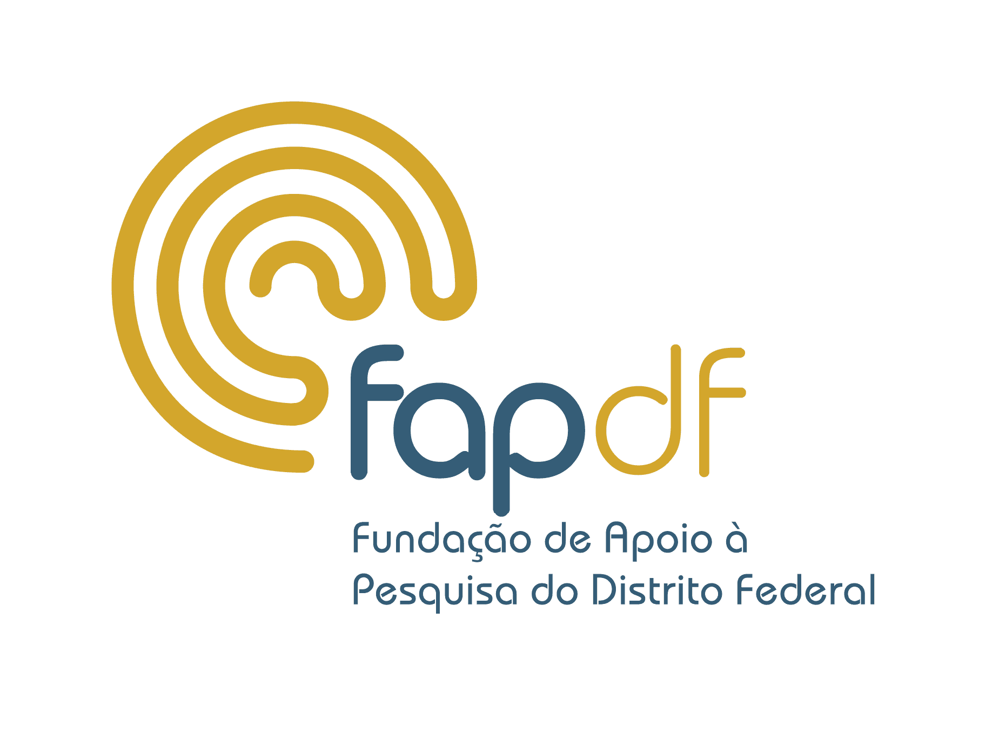

# MAPA-PG — Monitoramento e Análise de Produção Acadêmica da Pós-Graduação

Sistema interativo em HTML5 para acompanhamento, gestão e análise comparativa de programas de pós-graduação brasileiros na área de Astronomia / Física, com dados do Portal de Dados Abertos da CAPES.

<p align="center">
  
</p>

---

## Autor

**Prof. David L. Azevedo** - Instituto de Física, Universidade de Brasília (UnB)
E-mail: david888azv@unb.br

---

## Funcionalidades

- Comparativo de produtividade entre programas com notas CAPES 5, 6 e 7
- Análise ao longo de três quadriênios (2013-2016, 2017-2020, 2021-2024)
- Filtros por nota, quadriênio, região, IES, categoria docente, tipo de produção e estrato de fator de impacto
- Média nacional de todas as áreas (opcional) para comparação nos gráficos e tabelas
- Gráficos interativos (barras, linhas, evolução temporal)
- Tabelas detalhadas com ranking de programas
- Relatório de fator de impacto (OpenAlex)
- Exportação de dados (CSV), gráficos (PNG) e relatórios (TXT)
- Glossário completo de 66 programas de Física/Astronomia com datas de fundação

## Como Executar

1. Abra o arquivo `1.4-mapa-pg.html` em qualquer navegador moderno (Chrome, Firefox, Edge, Safari)
2. Na primeira abertura é necessária conexão com internet para carregar Chart.js via CDN
3. O sistema carrega automaticamente o `dados_fisica.json`

**Compatível com Windows, Linux e macOS. Nenhuma instalação necessária.**

## Estrutura

```
mapa-pg/
  1.4-mapa-pg.html   - Aplicação principal (HTML5, autocontida)
  help-doc.html      - Documentação, fontes de dados e glossário de siglas
  dados_fisica.json  - Dados pré-processados de 67 programas
  LEIA-ME.txt        - Instruções em português
  logos/             - Logos das agências de fomento
```

## Fonte dos Dados

Todos os dados utilizados foram obtidos do [Portal de Dados Abertos da CAPES](https://dadosabertos.capes.gov.br/), como parte da iniciativa do Governo Federal de transparência e acesso à informação pública (Lei de Acesso à Informação — Lei nº 12.527/2011). Os dados são públicos e de livre acesso.

As URLs para download de todos os dados brutos estão documentadas no arquivo `help-doc.html`.

## Acknowledgments

This work was supported by the Brazilian research agencies CAPES and CNPq. The author acknowledges the Distrito Federal Research Foundation (FAPDF) for financial and equipment support (Grants 04/2017 and 09/2022). D.L.A. acknowledges additional support from CNPq research productivity fellowship (Proc. 306456/2025-7).

<p align="center">
  &nbsp;&nbsp;&nbsp;
  &nbsp;&nbsp;&nbsp;
  
</p>

---

**MAPA-PG** v1.4 | Abril 2026 | Prof. David L. Azevedo | Universidade de Brasília (UnB)
